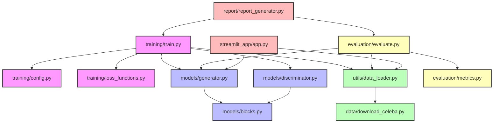

# Image Inpainting with GANs

This project implements an image inpainting system using a GAN-based architecture with attention mechanisms. The system is capable of restoring missing or damaged regions in images, particularly focusing on facial images from the CelebA dataset.

## Features

- GAN-based architecture with attention mechanisms
- Custom mask generation (rectangular and elliptical)
- Interactive Streamlit web interface
- MLflow experiment tracking
- Docker support
- Comprehensive evaluation metrics (PSNR, SSIM, FID)

## Project Structure

```
.
├── data/               # Dataset directory
├── models/            # Model architectures
│   ├── blocks.py     # Basic building blocks
│   ├── generator.py  # Generator architecture
│   └── discriminator.py # Discriminator architecture
├── utils/            # Utility functions
│   └── data_loader.py # Data loading and preprocessing
├── training/         # Training scripts
│   ├── train.py     # Main training script
│   └── loss_functions.py # Loss function implementations
├── evaluation/       # Evaluation scripts
│   ├── evaluate.py  # Main evaluation script
│   └── metrics.py   # Metric implementations
├── streamlit_app/   # Web interface
│   └── app.py      # Streamlit application
├── docker/         # Docker configuration
│   ├── Dockerfile
│   └── docker-compose.yml
└── requirements.txt # Project dependencies
```

## Installation

1. Clone the repository:
```bash
git clone https://github.com/yourusername/cv-inpainting.git
cd cv-inpainting
```

2. Create a virtual environment and install dependencies:
```bash
python -m venv venv
source venv/bin/activate  # On Windows: venv\Scripts\activate
pip install -r requirements.txt
```

3. Download the CelebA dataset (instructions in the Dataset section below).

## Usage

### Training

To train the model:

```bash
python training/train.py
```

The training script supports various configuration options. Check the script for details.

### Evaluation

To evaluate a trained model:

```bash
python evaluation/evaluate.py
```

### Web Interface

To run the Streamlit interface:

```bash
streamlit run streamlit_app/app.py
```

### Docker

To run the application using Docker:

```bash
docker-compose -f docker/docker-compose.yml up --build
```

## Dataset

The project uses the CelebA dataset with custom-generated masks. To download the dataset:

1. Visit [CelebA official website](http://mmlab.ie.cuhk.edu.hk/projects/CelebA.html)
2. Download the Aligned & Cropped Images
3. Place the images in the `data/celeba` directory

## Model Architecture

The inpainting model consists of:
- Generator: U-Net architecture with attention mechanisms
- Discriminator: PatchGAN discriminator
- Custom attention blocks for better context understanding

## Evaluation Metrics

- PSNR (Peak Signal-to-Noise Ratio)
- SSIM (Structural Similarity Index)
- FID (Fréchet Inception Distance)

## Contributing

Contributions are welcome! Please feel free to submit a Pull Request.

## License

This project is licensed under the MIT License - see the LICENSE file for details.

---

# Project Requirements

# Project 3

**Description**

You should create a system that will solve a computer vision problem of your choice using neural networks. The problem you choose, along with the dataset, should be unique among all groups. For example:

*   Several pairs can solve the same problem but must have different datasets.
*   You can use the same dataset but solve a different problem.

**Main Requirements:**

*   Preparation and presentation of a selected dataset (any based on visual data).
*   Preparation and presentation of the main functionality based on neural networks.
*   Presentation of the report.

The final grade depends on the number of points scored for each project element.

**Selected:**
Problem: Image Inpainting
Dataset: CelebA with custom masks
Brief Description:
We aim to create a system that restores missing regions in images using neural networks. The main model will feature a GAN-based architecture with contextual loss and attention mechanisms for high-quality results. We will use the CelebA dataset, augmenting it with custom masks to meet the requirements. Our final deliverables will include a detailed report, a trained model, and a streamlit dashboard for real-time inpainting.

## Problem:

**Requirements**

There can be no classification or regression as the primary problem; other problems are open for discussion.

| Problem             | Points |
|----------------------|--------|
| Semantic segmentation | 1      |
| Instance segmentation | 3      |
| Colorization          | 1      |
| Depth estimation      | 1      |
| Domain adaptation     | 3      |
| Super-resolution      | 3      |
| Image inpainting      | 3      |
| Search engine         | 2      |
| 3D reconstruction     | 4      |

**Additional Points:**

*   Solving an additional problem to improve prediction quality (e.g., additional loss functions for object detection and classification): +1 point

## Model:

**Requirements**

| 1st Model                               | Points |
|-----------------------------------------|--------|
| Pre-trained model on the same problem   | 0      |
| Pre-trained model on a different problem (transfer learning) | 1      |
| Ready architecture trained from scratch | 1      |
| Own architecture (over 50% own layers)   | 2      |

**Additional Points:**

*   Each subsequent model with a different architecture: +1 point
*   For each subsequent *own* architecture (over 50% own layers): +2 points
*   +1 point for every non-trivial solution in the own architecture (use of attention, GAN, RL, contrastive learning, metric learning).

## Dataset:

Minimal size of input image: 200x200px.

**Requirements**

*   At least 1000 photos.
*   Not MNIST.

**Additional Points:**

*   Evaluation on a set with at least 10,000 photos: +1 point
*   Your own part of the dataset (> 500 photos): +1 point

## Training:

**Requirements**

*   Correctly selected loss function.
*   Data split into train, validation, and test sets.
*   Metrics (at least 2).

**Additional Points:**

*   Hyperparameter tuning or estimation: +1 point
*   Architecture tuning (at least 3 architectures): +1 point
*   Overfitting some examples from the training set: +1 point
*   Data augmentation: +1 point
*   Cross-validation: +1 point
*   Distributed learning: +1 point
*   Federated learning: +2 points
*   Testing a few optimizers (at least 3): +1 point
*   Testing various loss functions (at least 3): +1 point
*   Calculating intrinsic dimension: +1 point

## Tools:

**Requirements**

*   Git with Readme.

**Additional Points:**

*   MLflow, TensorBoard, Neptune, Weights & Biases (along with some analysis of experiments): +1 point
*   Run as Docker/Docker Compose: +1 point
*   REST API or GUI (e.g., Gradio, Streamlit): +1 point
*   DVC: +2 points
*   Every other MLOps tool: +1 point
*   Label Studio or other data labeling tools: +1 point

## Report:

**Requirements:**

*   Description of the dataset, with a few image examples.
*   Description of the problem.
*   Description of used architectures with a diagram showing the layers. For large models containing blocks, the blocks and the connections between them can be shown separately.
*   Model analysis: size in memory, number of parameters.
*   Description of the training and the required commands to run it.
*   Description of used metrics, loss, and evaluation.
*   Plots: training and validation loss, metrics.
*   Used hyperparameters along with an explanation of why each value was chosen.
*   Comparison of models.
*   List of libraries and tools used (can be a `requirements.txt` file).
*   Description of the runtime environment.
*   Training and inference time.
*   Preparation of a bibliography. The bibliography should contain references to the dataset (preferably the article in which the collection was presented) and all scientific works and studies, including websites with tips on the solution.
*   A table containing all the completed items with points.
*   Link to Git.

## Grading:

If you do the project alone, the total number of points needed for the grade is lower than if you do the project in a pair.

*   **3:**
    *   All elements from the report and code.
    *   Problem >= 1 point.
    *   Model >= 1 point.
    *   Sum of additional points from dataset, training, tools, report >= 3 points.
    *   Sum of points >= 6 (pair) / 5 (alone).

*   **4:**
    *   Problem >= 1 point.
    *   Model >= 2 points.
    *   Sum of additional points from dataset, training, tools, report >= 3 points.
    *   Sum of points >= 10 (pair) / 9 (alone).

*   **5:**
    *   Problem >= 1 point.
    *   Model >= 3 points.
    *   Sum of additional points from dataset, training, tools, report >= 3 points.
    *   Sum of points >= 14 (pair) / 12 (alone).

*   **6:**
    *   Problem >= 1 point.
    *   Model >= 3 points.
    *   Sum of points >= 18 (pair) / 15 (alone).

## Project Architecture


