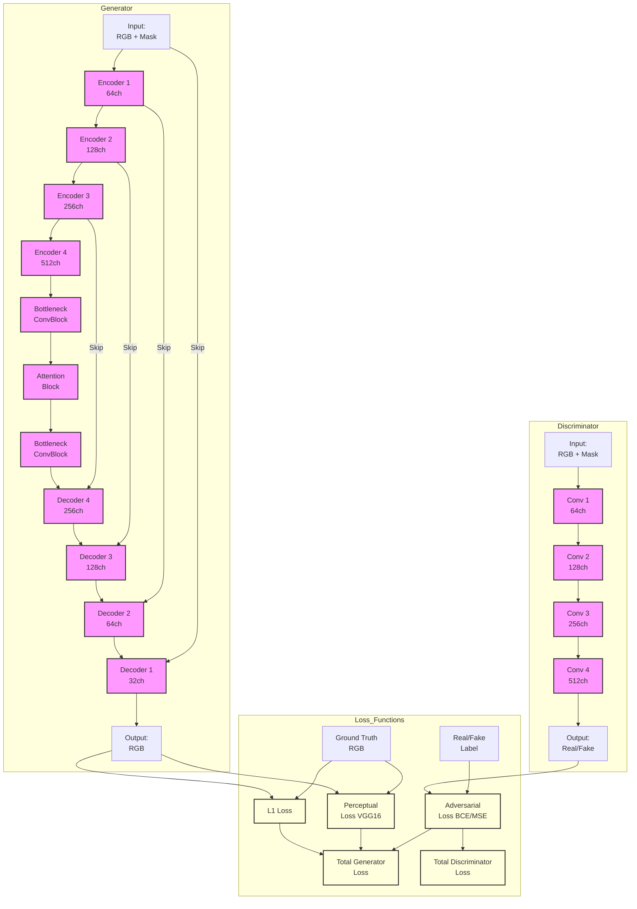

# Model Architecture

## Skip Connections
Skip connections, also known as residual connections, are direct paths between encoder and decoder layers that bypass the bottleneck. They serve several important purposes:
1. **Preserve Fine Details**: Allow high-resolution features from encoder layers to directly reach decoder layers
2. **Prevent Information Loss**: Help maintain spatial information that might be lost during downsampling
3. **Ease Gradient Flow**: Make training deeper networks easier by providing direct paths for gradient backpropagation
4. **Feature Reuse**: Enable the decoder to combine high-level semantic features with low-level detail features

In our architecture, skip connections connect each encoder block to its corresponding decoder block at the same resolution level.

## Architecture Diagram

## Loss Functions
1. **L1 Loss**: Pixel-wise absolute difference between generated and ground truth images
   - Weight (λ₁): 100
   - Purpose: Ensure color and structural accuracy

2. **Perceptual Loss**: Feature-level difference using VGG16 network
   - Weight (λ₂): 10
   - Purpose: Capture high-level semantic similarities

3. **Adversarial Loss**: Binary Cross Entropy (BCE) or Mean Squared Error (MSE)
   - Purpose: Train generator to produce realistic images that can fool the discriminator
   - Used in both generator and discriminator training

Total Generator Loss = Adversarial Loss + 100 * L1 Loss + 10 * Perceptual Loss
Total Discriminator Loss = Average of real and fake adversarial losses
